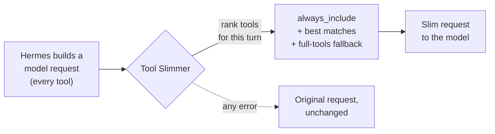

<div align="center">


# Hermes Tool Slimmer

**Send your model the tools it needs for this turn, not your whole catalog.**

A [Hermes Agent](https://github.com/NousResearch/hermes-agent) plugin that trims the tool schemas sent with each model request, with a dashboard to see how much it saves.

[](https://github.com/aliasocracy/hermes-tool-slimmer/actions/workflows/tests.yml)


[Quick start](#-quick-start) · [How it works](#-how-it-works) · [Modes](#-modes) · [Configure](#%EF%B8%8F-configure) · [Commands](#-commands) · [Docs](#-docs)

</div>

---

Every model call in Hermes carries the full JSON schema of every enabled tool. With dozens of native and MCP tools, that is often 15–20k tokens per request, resent on every step of every turn. Tool Slimmer ranks the tools against what you actually asked and sends only your always-on tools plus the best matches.

| Average tool tokens per request<br><sub>40 prompts, real 38-tool Hermes install</sub> | |
|---|---:|
| No slimming | ~15.1k |
| `keyword` mode (default, fully local) | **~7.9k** &nbsp;(−48%) |
| `jev` mode (experimental) | **~4.3k** &nbsp;(−71%) |

## ✨ Highlights

- **Local and deterministic by default.** BM25 ranking with name, toolset, parameter and alias boosts. No embeddings, no extra model calls, no network.
- **Fails open.** Any selector error sends the original, unmodified tool list.
- **Nothing gets stranded.** A built-in `tool_slimmer_request_full_tools` fallback lets the model ask for the full catalog on the next request if it needs a tool that was trimmed.
- **No Hermes core patch on v0.19+.** Hooks in through Hermes' built-in `llm_request` middleware, so updates and Docker rebuilds don't break it.
- **Per-entry-point profiles.** Give Telegram, Slack, CLI, cron and webhooks their own budgets and include/exclude lists.
- **Dashboard.** Savings, recent decisions, guided setup, one-click recommended config with backups, and a tool index browser.
- **Respects Hermes.** It only selects schemas. Approval prompts, disabled tools and toolsets, auth and runtime safety policy are untouched.

## 🚀 Quick start

On the machine that runs Hermes:

```bash
git clone https://github.com/aliasocracy/hermes-tool-slimmer.git "$HOME/hermes-tool-slimmer"
```

```bash
bash "$HOME/hermes-tool-slimmer/scripts/install-hermes-tool-slimmer.sh"
```

```bash
hermes tool-slimmer doctor
```

The installer installs the package, copies the dashboard plugin, enables the plugin in Hermes, picks a selector surface, restarts services and prints a health report.

> [!TIP]
> Want to look before it changes anything? Set `dry_run: true` and watch decisions in the dashboard, then flip it to `false` once `doctor` reports a selector surface and you're happy with what it picks. See [`docs/quickstart.md`](docs/quickstart.md) for the full walkthrough.

**Prefer the dashboard?** On Hermes builds with dashboard plugin install, paste `aliasocracy/hermes-tool-slimmer` on the **Plugins** page, then restart the gateway. That keeps a git checkout, so the dashboard **Update** button works later.

<details>
<summary><b>Updating an existing install</b></summary>

<br>

Update the checkout, then rerun the installer. The installer installs whatever version is in the checkout you run it from, so an old checkout (for example a stale `/tmp/hermes-tool-slimmer` an agent created) reinstalls that old version.

```bash
cd "$HOME"
if [ -d "$HOME/hermes-tool-slimmer/.git" ]; then
  cd "$HOME/hermes-tool-slimmer"
  git pull --ff-only
else
  git clone https://github.com/aliasocracy/hermes-tool-slimmer.git "$HOME/hermes-tool-slimmer"
  cd "$HOME/hermes-tool-slimmer"
fi

HERMES_BIN="$HOME/.hermes/hermes-agent/venv/bin/hermes" bash "$HOME/hermes-tool-slimmer/scripts/install-hermes-tool-slimmer.sh"
```

To update **Hermes** itself, use the bundled helper. It runs `hermes update --yes`, keeps Hermes' normal backups, reapplies the Tool Slimmer core hook on Hermes versions that need it, restarts services and finishes with `doctor`:

```bash
scripts/update-hermes-and-repair-tool-slimmer.sh
```

</details>

<details>
<summary><b>Multiple <code>hermes</code> launchers, blocked scripts, and self-heal</b></summary>

<br>

**Multiple launchers.** Point the installer at the Hermes venv launcher so the package lands in the same Python environment Hermes runs from:

```bash
HERMES_BIN="$HOME/.hermes/hermes-agent/venv/bin/hermes" bash "$HOME/hermes-tool-slimmer/scripts/install-hermes-tool-slimmer.sh"
```

**Blocked script execution.** If an agent or hosted approval layer blocks the installer, run it from a normal terminal or approve that exact command. A block here means the environment denied running the script, not that Hermes or Tool Slimmer is broken. Avoid running installers from a predictable shared `/tmp` checkout.

**Self-heal after reboots (systemd).** On login or boot, this runs `doctor` and, if Tool Slimmer is enabled but not wired into Hermes, reruns the local installer and restarts only active Hermes services. It never runs `git pull` or `hermes update`, and it never changes config.

```bash
scripts/self-heal-tool-slimmer.sh --install-systemd
```

</details>

<details>
<summary><b>Let Hermes install it for you</b></summary>

<br>

Give Hermes Agent this instruction:

```text
Install Hermes Tool Slimmer from https://github.com/aliasocracy/hermes-tool-slimmer.
Use $HOME/hermes-tool-slimmer as the checkout path. If it already exists and is a git checkout, run git pull --ff-only there first. If it does not exist, clone the repo there.
Do not use an old /tmp/hermes-tool-slimmer checkout.
Then run:
HERMES_BIN="$HOME/.hermes/hermes-agent/venv/bin/hermes" bash "$HOME/hermes-tool-slimmer/scripts/install-hermes-tool-slimmer.sh"
If the environment asks for approval to run that script, request approval for that exact command.
Then verify with:
$HOME/.hermes/hermes-agent/venv/bin/hermes tool-slimmer doctor
```

</details>

### Hermes compatibility

| Hermes Agent | How Tool Slimmer slims requests |
|---|---|
| **v0.19 and newer** | Built-in `llm_request` middleware. No core patch. |
| **Older** (monolithic `run_agent.py` or the v0.14 modular loop) | The installer adds a small `select_tool_schemas` hook to Hermes core. The update helper and self-heal service reapply it after Hermes updates. |
| No usable surface | Dashboard, diagnostics, dry-run, evals and config advice still work, but requests aren't slimmed. |

Only one surface is ever registered, so a request is never slimmed twice. `hermes tool-slimmer doctor` reports the active one under `core_selector_hook.detail.surface`.

> [!NOTE]
> **Hermes native Tool Search.** Recent Hermes builds include a native progressive tool loader (`tool_search`, `tool_describe`, `tool_call`) that activates when MCP and plugin tools cross Hermes' own schema budget. For very large MCP catalogs it's probably the better default, because it lives in core and can lazily reach deferred tools.
>
> Tool Slimmer detects that bridge and won't double-slim those requests. The dashboard, counters, diagnostics and evals keep working. To make Tool Slimmer the active selector instead, set `tools.tool_search.enabled: "off"` in Hermes config. Don't run `two_pass` on top of native Tool Search unless you're deliberately testing it.

## 🔍 How it works



1. **Filter.** Disabled tools and toolsets, `always_exclude`, and the MCP/native include switches are applied first.
2. **Rank.** The current user turn is scored against each tool's name, description, toolset, parameters and your `aliases`. Low-information turns (`hi`, `thanks`, `ping`) skip ranking entirely.
3. **Select.** `always_include` tools come first and don't count against `top_k`. The best `top_k` matches above `min_score` follow, in catalog order so provider prompt caches keep hitting across a turn's tool loop.
4. **Guard.** If the saving is below `min_estimated_reduction_percent`, or anything throws, the original request goes out untouched.

## 🎛️ Modes

| Mode | What it does | Leaves your machine? |
|---|---|---|
| `keyword` **(default)** | Local BM25 plus boosts and a small synonym map. | No |
| `hybrid` | `keyword` plus a fuzzy-token boost for near-miss spellings. | No |
| `two_pass` 🧪 | Model first sees a compact catalog and asks for the full schemas it wants. | No |
| `jev` 🧪 | Keyword shortlist re-ranked by the [TypeSafe Jev](https://docs.typesafe.ai/introduction) decision model. | Yes, to TypeSafe |
| `anthropic_tool_search` | Anthropic Tool Search / deferred loading, where Hermes' provider stack supports it. | Provider only |
| `eager` | No slimming. Useful as a baseline. | No |

On providers without Anthropic Tool Search (OpenRouter, OpenAI, local servers), Tool Slimmer uses deterministic selection and never sends Anthropic-only definitions.

<details>
<summary><b>🧪 <code>two_pass</code>: for huge catalogs and TPM-capped providers</b></summary>

<br>

The first request gets your `always_include` tools plus `tool_slimmer_hydrate_tools`, which carries a compact catalog of tool names, one-line descriptions, toolsets and tags. If the model needs tools, it calls `tool_slimmer_hydrate_tools` with several names at once, and the next request exposes those full schemas. With `cache_hydrated_tools: true` they stay for the rest of the session.

It can add one extra model round trip before tool use, and Hermes history may still record the hydration call. It never injects the full catalog on ordinary no-tool turns. Keep `keyword` for normal use.

</details>

<details>
<summary><b>🧪 <code>jev</code>: highest precision, one tiny API call per turn</b></summary>

<br>

Tool Slimmer takes the top `jev.shortlist` keyword candidates and asks Jev one yes/no question per tool, all in a single request: *would an assistant need to call this tool to fulfill the request?* It keeps your `always_include` tools plus every candidate at or above `jev.threshold`, capped at `top_k`.

- Set `TYPESAFE_API_KEY` (or the variable named in `jev.api_key_env`) in the environment Hermes runs in, then restart Hermes.
- **One call per user turn.** Later model calls in the same tool loop reuse the cached answer, and tools already used this turn stay selected.
- **Fails safe.** A missing key, timeout, rate limit or bad response falls back to keyword selection, and Jev is skipped for `cooldown_seconds`.
- **Privacy.** This is the only mode that sends data out. Each turn's request text plus the candidate tools' names and descriptions go to TypeSafe. Conversation history, tool results and memory are not sent. See [`docs/privacy.md`](docs/privacy.md).

| On 40 hand-written prompts, 38-tool catalog | `keyword` | `jev` (0.5) | `jev` (0.7) |
|---|:-:|:-:|:-:|
| Tool prompts with a needed tool selected | 30 / 34 | **34 / 34** | 34 / 34 |
| Avg tools beyond `always_include` | 8.1 | 2.8 | 1.8 |
| Extra tools on no-tool prompts | 8.2 | **0** | 0 |
| Avg tool tokens per request | ~7.9k | ~4.3k | ~3.6k |

Median Jev latency was about 190 ms at roughly 4.8k input tokens (about $0.0002) per call. The default threshold stays at 0.5 because real requests are messier than hand-written ones.

</details>

## ⚙️ Configure

Tool Slimmer reads the `tool_slimmer` section of your Hermes `config.yaml`. `hermes tool-slimmer advisor` (or **Apply Config** in the dashboard) can write a recommended setup for you, with a backup.

```yaml
plugins:
  enabled:
    - tool-slimmer

tool_slimmer:
  enabled: true
  mode: keyword        # eager | keyword | hybrid | anthropic_tool_search | two_pass | jev
  top_k: 8             # ranked tools, on top of always_include
  always_include: [terminal, read_file, write_file, patch, search_files]
  always_exclude: []   # alias for disabled_tools; hide noisy tools from ranking
  never_defer: [terminal, read_file]
  include_mcp_tools: true
  include_native_tools: true
  log_decisions: true
  min_total_tools: 0
  min_estimated_reduction_percent: 5.0
  min_score: 0.25
  aliases:
    browse: [browser, navigate, url, website]
  fail_open: true      # selector errors send the original tool list
  dry_run: false       # true: log decisions without changing requests

  two_pass:            # only used by mode: two_pass
    hydrate_limit: 8
    max_catalog_tools: 120
    cache_hydrated_tools: true
    fallback_to_keyword: true

  jev:                 # only used by mode: jev
    model: jev-latest
    api_key_env: TYPESAFE_API_KEY
    threshold: 0.5     # keep tools Jev rates at least this likely to be needed
    shortlist: 32      # keyword-ranked candidates sent to Jev
    timeout_seconds: 1.5
    cooldown_seconds: 60

  profiles:            # per entry point overrides
    telegram:
      top_k: 4
      always_include: [memory, tool_slimmer_request_full_tools]
      always_exclude: [terminal, cronjob]
    slack:
      top_k: 6
      always_include: [memory, read_file, search_files, tool_slimmer_request_full_tools]
      always_exclude: [cronjob]
    cli:
      top_k: 8
```

<details>
<summary><b>What each knob does, and the safety model</b></summary>

<br>

- **`always_include`** tools are selected first when Hermes has them enabled, and they don't count against `top_k`.
- **`top_k`** is the ranked budget. `top_k: 0` means "select no ranked tools", not "fail open". Start at 8. Values like 4 suit narrow Telegram or webhook bots but raise the risk of missing a tool unless you pair them with explicit include and exclude lists.
- **`always_exclude`** is a friendlier name for `disabled_tools`. Excluded tools never appear in Tool Slimmer's ranked set.
- **`disabled_tools`, `disabled_toolsets`, `include_mcp_tools`, `include_native_tools`** are applied before ranking.
- **`aliases`** expand query words deterministically. They change ranking and score details, never stored schemas. Keyword mode is intentionally mostly literal, so add tool-specific synonyms here or to tool descriptions.
- **`min_score`** stops tiny keyword matches from filling every `top_k` slot.
- **`min_total_tools`** skips catalogs smaller than this. The default of 0 means subagents and restricted toolsets still get ranked.
- **`min_estimated_reduction_percent`** sends the original list when the saving is too small to be worth changing the request. In `anthropic_tool_search` mode it's measured against the hot set, and Tool Search helpers never defer every tool.
- **`profiles`** let Slack, Telegram, CLI, cron and webhook entry points each get their own `top_k` and include/exclude lists.
- **`tool_slimmer_request_full_tools`** is always kept when Hermes has registered it. If a skill or task needs a hidden tool, the model calls it, and the next request carries the full list, so it never has to invent a workaround.
- **`dry_run: true`** logs decisions and leaves requests untouched.
- **`fail_open: true`** sends the original list on any selector error.

</details>

## 📊 Dashboard


The **Tool Slimmer** page in the Hermes dashboard shows estimated tokens saved, average reduction, selector overhead and recent decisions. It also has a **Guided Setup** checklist, **Apply Recommended Config** with automatic backups, a **Tune Latest Selection** panel for pinning or blocking a tool per entry point, and a **Tool Index** browser with a one-click rebuild from live Hermes tools. See [`docs/dashboard-plugin.md`](docs/dashboard-plugin.md).

> [!IMPORTANT]
> **About the numbers.** "Schema tokens saved" is an estimate: serialized tool-schema JSON bytes ÷ 4, before and after selection. Real billed tokens depend on the provider tokenizer, prompt formatting, caching and everything else in the request. Treat it as a consistent measure of the tool-catalog overhead removed, not an invoice. Headline totals count real Hermes sessions only. Probe events without a `session_id` are kept in the API's `all_summary` field for audits.

## 💻 Commands

```bash
hermes tool-slimmer status              # config and tool index summary
hermes tool-slimmer doctor              # health checks, including the active selector surface
hermes tool-slimmer privacy             # what is logged, and what (if anything) leaves the machine
hermes tool-slimmer diagnostics

hermes tool-slimmer select "search this repo for MCP registration code" --schemas tools.yaml
hermes tool-slimmer index rebuild --schemas examples/tools.yaml
hermes tool-slimmer index show --top 20

hermes tool-slimmer eval --prompts examples/prompts.yaml --schemas examples/tools.yaml [--markdown]
hermes tool-slimmer benchmark --prompts examples/prompts.yaml --schemas examples/tools.yaml

hermes tool-slimmer analyze-config
hermes tool-slimmer recommend-config
hermes tool-slimmer advisor [--apply]
hermes tool-slimmer advisor --rollback ~/.hermes/tool-slimmer/backups/config-YYYYmmdd-HHMMSS.yaml
```

In chat:

```text
/tool-slimmer status
/tool-slimmer select search this repo for MCP registration code
/tool-slimmer dry-run on
/tool-slimmer dry-run off
```

For a plain-English health report, run `scripts/troubleshoot-hermes-tool-slimmer.sh`.

## 📚 Docs

| | |
|---|---|
| [Quickstart](docs/quickstart.md) | Install, dry run and activation walkthrough |
| [Guided setup](docs/guided-setup.md) | Dashboard-first setup |
| [Dashboard plugin](docs/dashboard-plugin.md) | Dashboard install and features |
| [Troubleshooting](docs/troubleshooting.md) | Common operational issues |
| [Privacy](docs/privacy.md) | Decision log fields and what each mode sends |
| [Hermes core integration](docs/hermes-core-integration.md) | Selector surfaces and the core hook contract |
| [Core selector hook patch](docs/hermes-core-selector-hook.patch) | Minimal upstreamable patch for older Hermes |
| [Anthropic Tool Search](docs/anthropic-tool-search.md) | Provider capability notes |
| [Latest eval](docs/reports/latest-eval.md) | Reproducible example evaluation |
| [`examples/`](examples/) | Sample config, prompts, schemas and expected output |
| [Changelog](CHANGELOG.md) | Release notes |

## 🛠️ Development

```bash
uv sync --extra dev
uv run ruff check .
uv run mypy src
uv run python -m compileall -q src tests dashboard-plugin/tool-slimmer
uv run pytest -q
```

These are the same checks CI runs. Before a release, also run `python -m build`, and if you touched the Hermes core patch, follow [`docs/release-checklist.md`](docs/release-checklist.md). See [CONTRIBUTING.md](CONTRIBUTING.md) for more.

## 💬 Support

Install bugs, dashboard issues, ranking misses and config questions go in [this repo's issues](https://github.com/aliasocracy/hermes-tool-slimmer/issues), please, not unrelated Hermes Agent threads. You can also reach Aliasocracy on Discord at `Aliasocracy#1439`. Mention Hermes Tool Slimmer so it's clear what the message is about.

<div align="center">
<sub>MIT licensed · Built for <a href="https://github.com/NousResearch/hermes-agent">Hermes Agent</a></sub>
</div>
